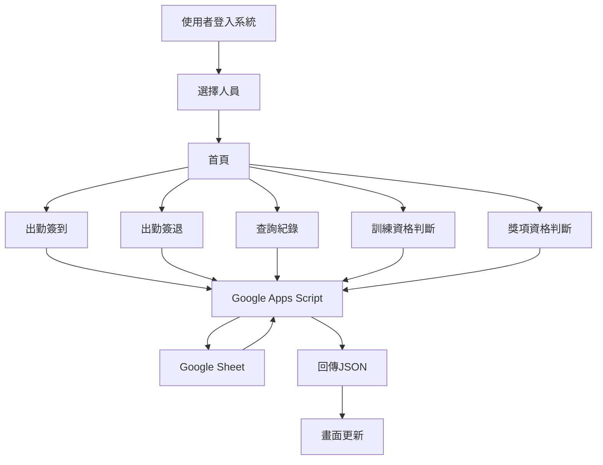
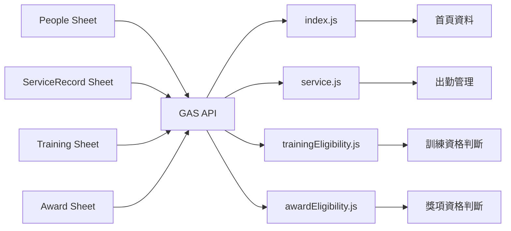

# 新興救護義消差勤管理系統

## 專案介紹

本系統為「高雄市義勇消防總隊第一救護大隊新興分隊」設計之差勤管理系統。

目的：

* 義消出勤簽到
* 義消出勤簽退
* 常年訓練管理
* 訓練資格判斷
* 獎項資格判斷
* 個人服務時數查詢
* 個人訓練紀錄查詢
* 義消資料集中管理

系統採用：

* Frontend：Bootstrap 5 + jQuery
* Backend：Google Apps Script
* Database：Google Sheet

設計原則：

* 簡單
* 穩定
* 易維護
* 易擴充
* 集中設定管理

---

# 檔案架構

```text
project
│
├─ index.html
├─ service.html
├─ training.html
├─ award.html
│
├─ css
│   ├─ navbar.css
│   ├─ index.css
│   ├─ service.css
│
├─ js
│   ├─ config.js
│   ├─ navbar.js
│   ├─ position.js
│   ├─ trainingEligibility.js
│   ├─ awardEligibility.js
│   ├─ index.js
│   ├─ service.js
│
├─ sampleData.json
│
├─ AppsScript
│   ├─ Code.gs
│   ├─ People.gs
│   ├─ ServiceRecord.gs
│   ├─ Training.gs
│   ├─ Award.gs
│
└─ README.md
```

---

# 系統架構

```text
使用者
   │
   ▼
Bootstrap + jQuery
   │
   ▼
AJAX / Fetch
   │
   ▼
Google Apps Script
   │
   ▼
Google Sheet
```

---

# Mermaid 系統流程圖



---

# Mermaid 資料流程圖



---

# 出勤管理規則

## 簽到

條件：

* 必須先定位成功
* 不可有未簽退紀錄
* 建立新紀錄

執行：

```text
createServiceRecord
```

---

## 簽退

條件：

* 必須存在未簽退紀錄
* 必須完成簽名

執行：

```text
updateOpenRecord
```

---

## 修改紀錄

條件：

* 已存在紀錄

執行：

```text
editServiceRecord
```

---

## 刪除紀錄

條件：

* 已存在紀錄

執行：

```text
deleteServiceRecord
```

---

# 訓練資格規則

## 新進人員基本訓練

符合條件：

* 入隊三年內

法規：

* 義勇消防組織訓練演習服勤辦法 §10

---

## 基礎幹部講習班

符合條件：

* 已完成新進人員基本訓練
* 三年內完成

法規：

* 義勇消防組織訓練演習服勤辦法 §12

---

## 初級幹部講習班

符合條件：

* 已完成新進人員基本訓練
* 曾任或現任小隊長以上職務
* 累計滿一年以上

或

* 已完成基礎幹部講習班

法規：

* 義勇消防組織訓練演習服勤辦法 §12

---

# 獎項資格規則

## 全國消防楷模

條件：

* 服務滿5年以上

---

## 全國救護志工菁英

條件：

* 服務滿5年以上
* 協勤時數1000小時以上

---

## 義消40年績優人員

條件：

* 服務滿40年

---

## 義消45年績優人員

條件：

* 服務滿45年

---

# 開發規範

## JavaScript

規則：

* function 單一職責
* 不重複程式碼
* 命名一致

範例：

```javascript
loadPeople()

loadServiceRecords()

buildTrainingEligibilityList()

buildAwardEligibilityList()
```

---

## Config 集中管理

所有固定規則集中：

```javascript
config.js
```

包含：

* API URL
* 訓練規則
* 獎項規則
* 顯示文字
* 下拉選單

---

## Google Sheet

禁止直接寫死欄位位置

使用：

```javascript
headerIndex
```

取得欄位位置

---

## UI 規範

統一使用：

* Bootstrap Card
* Bootstrap Modal
* Bootstrap Badge
* Bootstrap Progress

避免自行客製 CSS。

---

# ChatGPT 專案提示詞

你是一位資深全端工程師。

請協助我開發：

「新興救護義消差勤管理系統」

技術：

Frontend：

* Bootstrap 5
* jQuery
* DataTables
* Font Awesome

Backend：

* Google Apps Script

Database：

* Google Sheet

開發原則：

* 簡單
* 穩定
* 易維護
* 易擴充
* 集中設定管理

程式規範：

* Config集中管理
* 不重複程式碼
* Function單一職責
* 保留既有功能
* 不刪除現有功能

回答格式：

1. 修正內容
2. 修正原因
3. 注意事項
4. 完整修正後代碼

若我要求：

「給我完整修正後的代碼」

請直接提供：

完整檔案內容

不要只提供片段程式碼。
